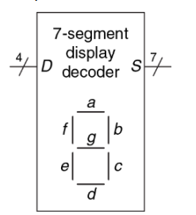
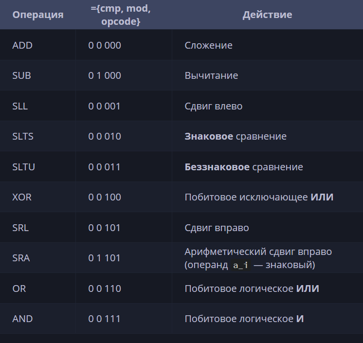
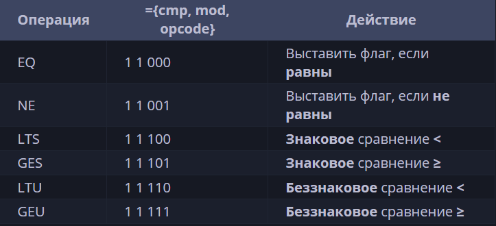

# Лабораторная работа 2

В данной лабораторной работе вам предстоит на основе описания принципа работы схемы описать ее на verilog. В данной работе нет проверки сигналов, вам необходимо разобраться в принципе работы схем, чтобы на основе сигналов понять, правильно ли ваш код синтезировался в схему. Также нет выходных и выходных сигналов, вам нужно будет самим определить их исходя из testbench.

## Синхронизатор
Требуется разработать модуль синхронизатора.

[Более подробное описание работы этой схемы](https://en.wikipedia.org/wiki/Metastability_(electronics)).

Основным модулем является top_module(**sync_top.v**). Testbench для проверки - **sync_top_tb.v**.

Результат работы показать преподавателю.

Стоит подумать о том, для чего он вообще нужен. В качестве наводки советую посмотреть про апертурное время в триггерах, динамическую дисциплину и метастабильность.

## ПЗУ
Требуется разработать модуль ПЗУ.

[Более подробное описание работы этой схемы](https://en.wikipedia.org/wiki/Read-only_memory).

Если вкратце о модуле: ПЗУ предназначено для хранения информации, которая записывается на этапе производства или в процессе программирования (ППЗУ) и используется преимущественно для чтения. В зависимости от типа, ПЗУ доступна или только операция чтения (PROM), или также многократная запись (для EPROM, EEPROM и Flash). Чтение производится по адресу.

Из всего этого можно сделать немного простых выводов, во-первых, ПЗУ можно реализовать с помощью специального блока, который может выбирать, во-вторых, что данные задаете вы внутри кода.

Данные выбирайте рандомно, и чтобы все были разные.

Основным модулем является top_module(**rom_top.v**). Testbench для проверки - **rom_top_tb.v**.

Результат работы показать преподавателю.

Стоит подумать о том, какая схема синтезируется после вашего кода.

## Дешифратор для 7-сегметного индикатора

Требуется разработать модуль, который по входной цифре будет выдавать его битовое представление для 7-сегментного индикатора.



Биты идут в таком порядке: abc_defg

Основным модулем является top_module(**sevenseg_top.v**). Testbench для проверки - **sevenseg_top_tb.v**.

Результат работы показать преподавателю.

Стоит подумать о том, как вы его реализовали.

## ОЗУ
Требуется разработать модуль ОЗУ с асинхронным чтением.

[Более подробное описание работы этой схемы](https://en.wikipedia.org/wiki/Random-access_memory).

Если вкратце о модуле, то в отличие от ПЗУ ОЗУ позволяет считывать и записывать информацию в процессе работы устройства, обеспечивая доступ к временным данным, необходимым для текущей работы системы. Чтение и запись происходит по одному и тому же адресу. Запись происходит синхронно и только тогда, когда соответствующий порт имеет высокое напряжение. Данные из внешнего выхода передается на внутренний регистр. Чтение же может быть и асинхронным, и синхронным. 

Из всего этого можно сделать немного простых выводов:

Для того, чтобы записать информацию в такую память необходимо:

- Выставить адрес в который планируется запись данных
- Выставить сами данные для записи на вход чтения
- Установить сигнал в состояние разрешения записи (1)
- Дождаться нужного (положительного, либо отрицательного) фронта clk — в этот момент данные будут записаны по указанному адресу.

Дополнительно к созданию ОЗУ добавьте туда параметры размера регистров и количество регистров, которое считаются как $2^N$, где N - количество бит адреса. Также сделайте так, чтобы нельзя было перезаписать адрес 0 и при обращении по адресу 0 должен выводиться 0.

Небольшая подсказка, описать массив M-битных регистров можно так: 
```verilog 
reg [M-1:0] registers [2^N-1:0];
```

Основным модулем является top_module(**ram_top.v**). Testbench для проверки - **ram_top_tb.v**.

Результат работы показать преподавателю.

Стоит посмотреть чем отличаются SRAM и DRAM, и как они реализуются на схемах.

## Регистровый файл

Модифицируйте ОЗУ так, чтобы было 2 порта чтения, которые независимы друг от друга, и один порт записи.

В этот раз без параметров, но правило с адресом 0 должно остаться.

Основным модулем является top_module(**file_reg_top.v**). Testbench для проверки - **file_reg_tb.v**.

Результат работы показать преподавателю.

## ALU

Требуется создать Арифметико-логическое устройство.

[Более подробное описание работы этой схемы](https://ru.wikipedia.org/wiki/%D0%90%D1%80%D0%B8%D1%84%D0%BC%D0%B5%D1%82%D0%B8%D0%BA%D0%BE-%D0%BB%D0%BE%D0%B3%D0%B8%D1%87%D0%B5%D1%81%D0%BA%D0%BE%D0%B5_%D1%83%D1%81%D1%82%D1%80%D0%BE%D0%B9%D1%81%D1%82%D0%B2%D0%BE).

АЛУ - это блок процессора, выполняющий арифметические и поразрядно логические операции.

Разница между арифметическими и логическими операциями в отсутствии у последних бита переноса, так как логические операции происходят между 1-битными числами и дают 1-битный результат, а в случае АЛУ (в рамках данной лабораторной работы) одновременно между 32-мя 1-битными парами чисел. В логических операциях результаты значений отдельных битов друг с другом никак не связаны.

Данный блок является комбинационной схемой. Задается адрес операции и два операнда, после чего происходит расчет соответствующего результата.

Также, кроме результата операций, АЛУ может формировать специальные сигналы-флаги, которые показывают выполняется ли заданное условие. Например, выводить 1, если один операнд меньше другого, или если в результате суммы произошло переполнение.

Пример ALU:


Для некоторых операций очень важно то, как вы интерпретируете данные, например для сложения это не важно, так как мы используем дополнительный код, но вот для операции сравнения это очень важно. 

Чтобы в Verilog интерпретировать число как знаковое, вам нужно обернуть его в $signed.

По данной таблице опишите 32-битный ALU на Verilog





Основным модулем является top_module(**alu_top.v**). Testbench для проверки - **alu_top_tb.v**.

Результат работы показать преподавателю.

Стоит подумать о примерной схеме, которая синтезируется после вашего кода. Также стоит подумать чем SLTS отличается от LTS и можно было бы обойтись не 5 битами на кодирование операции.

## LUT

Требуется создать таблицу подстановки.

Более подробное описание работы этой схемы будет описано на 4 лекции.

В этом задании вам предстоит разработать схему для памяти 8x1, в которой запись осуществляется путём сдвига битов по сигналу разрешения, а чтение — «random access», как в ОЗУ.

Сначала создайте 8-битный регистр сдвига с 8 D-триггерами. Обозначьте выходы триггеров Q[0]...Q[7]. Вход регистра сдвига должен быть обозначен как S, он поступает на вход Q[0] (старший бит сдвигается первым). Вход разрешения управляет сдвигом. Затем добавьте в схему 3 дополнительных входа A, B, C и выход Z. Схема должна вести себя следующим образом: когда ABC равен 000, Z=Q[0], когда ABC равен 001, Z=Q[1] и так далее. Ваша схема должна содержать ТОЛЬКО 8-битный регистр сдвига и мультиплексоры.

Основным модулем является top_module(**lut_top.v**). Testbench для проверки - **lut_top_tb.v**.

Результат работы показать преподавателю.

Стоит подумать, какие логические вентили были реализованы путем testbench с помощью вашего LUT. 